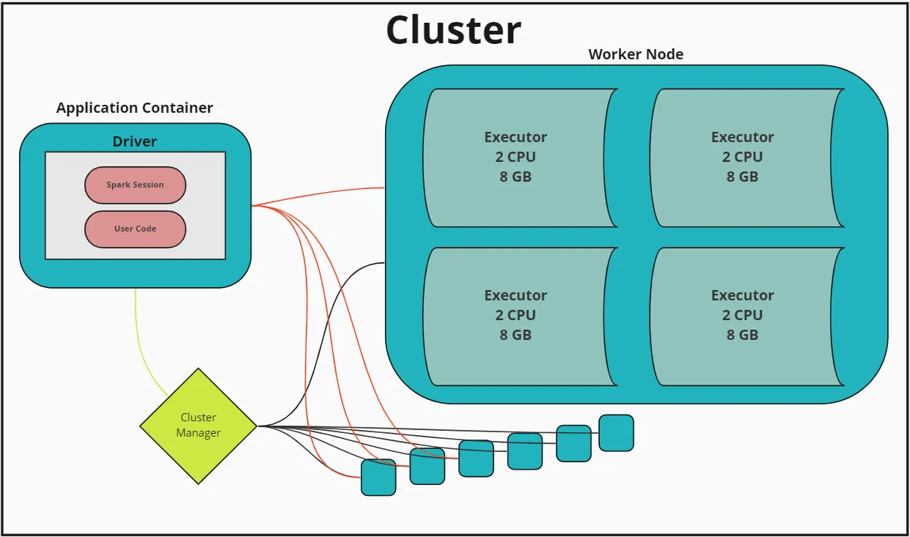

# Spark Core Concepts
## Resilient Distributed Datasets (RDDs):

The fundamental data structure of Spark.
An immutable distributed collection of objects, which can be processed in parallel.
RDDs can be created through deterministic operations on either data on disk or other RDDs.
Distributed Processing:

Spark distributes data across the cluster and processes them in parallel, which significantly speeds up the tasks.
Immutability and Fault Tolerance:

RDDs are immutable: once created, it cannot be changed. This simplifies computation and supports automatic recovery from node failures.
Fault tolerance is achieved through lineage. If a part of an RDD is lost, the RDD has enough information about how it was derived from other RDDs to rebuild just the lost partitions.
# Spark APIs and Libraries

## Spark SQL:

Allows querying data via SQL as well as Apache Hive variant of SQL — Hive Query Language (HQL).
Supports reading from and writing to various structured formats and sources like JSON, Hive Tables, Parquet files, etc.
Provides a DataFrame API which is conceptually equivalent to a table in a relational database or a data frame in R/Python, but with richer optimizations.

### Advanced Spark SQL Features
Spark SQL can handle a wide variety of data sources and has several advanced features:

- **Catalyst Optimizer Enhancements**: Understanding newer optimizations that can automatically be applied to Spark SQL queries.
- **Window Functions**: These are useful for a wide range of analytical tasks.
- **User-Defined Functions (UDFs)**: While Spark SQL has a rich set of built-in functions, sometimes specific data transformations are best implemented via UDFs.

## Spark Streaming:

Enables processing of live streams of data.
Examples of data sources include file systems, Kafka, Flume, and TCP sockets.
Provides a high-level abstraction called discretized stream or DStream, which represents a continuous stream of data and can be processed using Spark's core API.
MLlib (Machine Learning Library):

Spark’s scalable machine learning library.
Includes both algorithms for common learning settings (e.g., classification, regression, clustering, collaborative filtering) and tools for constructing, evaluating, and tuning ML pipelines.

## GraphX:

For graphs and graph-parallel computation.
Provides a flexible graph API that allows for the creation, transformation, and querying of graphs in a distributed setting.

## DataFrames and Datasets API
While you might already be familiar with these, ensuring a deep understanding of DataFrames and Datasets is crucial. These APIs are optimized for performance and provide a higher level abstraction for data manipulation and querying:

- **Datasets**: Type-safe JVM objects providing the benefits of RDDs with the optimization of DataFrames.
- **DataFrames**: Untyped API, conceptually equivalent to a table in a relational database or a data frame in R/Python but with richer optimizations under the hood.
 

# Spark Architecture

## Driver and Executors:

The driver is the process where the main() method of your program runs. It is the process running the user code that creates RDDs, and performs transformations and actions.
Executors are worker nodes' processes in charge of running the code in the cluster, and reporting the state of the computation, back to the driver.

## Cluster Manager:

Spark supports several cluster managers (Spark standalone, Apache Mesos, YARN, Kubernetes).
Responsible for allocating resources across applications and managing executors.

## Dynamic Resource Allocation
Dynamic allocation allows Spark to scale the number of executors dynamically based on the workload:

Executor Allocation: Configuring Spark to add or remove executors dynamically based on the requirements of the submitted job.

