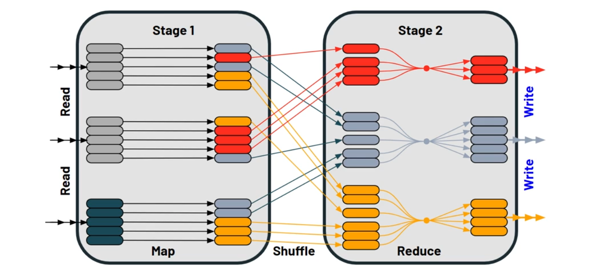

# Shuffle

In Apache Spark, shuffling is a process that redistributes data across different executors or even across machines and involves disk I/O, data serialization, and network I/O. It is one of the most expensive operations in terms of computation and resource utilization in Spark.



## What is Shuffling in Spark?
Shuffling occurs when the output of one RDD transformation needs to be redistributed to form another RDD, usually because certain operations require data to be grouped differently. This process is essential for many wide transformations, where multiple keys might be combined to compute a result.

## Causes

- **Data skew**: Spark shuffling may take place when some keys in a dataset are significantly more heavily populated with data than others. Data skew is the term used to describe this.

- **Operations** like groupByKey, reduceByKey or same sort of joins which call for the grouping or aggregation of data by key, can also cause data shuffling. But not only, the shuffling can be caused by different other factors like :

- **Partitioning**: Spark divides data among nodes through a procedure known as partitioning. The possibility of shuffling exists if the data is not distributed among partitions equally.

- **Spark operations**: Groupping, aggregating the data by key or when joining two datasets, some operations, such as groupByKey, reduceByKey and join, will cause shuffling.

- **Caching** : Shuffling may occur if a dataset is cached in memory and the amount of data in the cache exceeds the amount of memory on a single node.

- **Data locality**: Spark tries to minimize shuffling by putting data on the same node as the computation that will be run on it. It must be moved to the node where the computation is being done if the data is not already stored there.

## Operations That Cause Shuffling
1. Wide Transformations: Any operation that requires data to be grouped across partitions will induce a shuffle. Typical examples include:
   - reduceByKey(): Combines values with the same key using a function, e.g., summing up values across keys.
   - groupBy(): Groups data by a specific function or column.
   - join(): Joins two datasets on a particular key.
   - distinct(): Removes duplicates in an RDD.
   - repartition(): Increases or decreases the number of partitions in the dataset.
   - coalesce(): Decreases the number of partitions in the dataset, typically used to optimize the number of partitions after filtering a large dataset.
2. Aggregations and Collections: These are similar to wide transformations but specifically involve computations like counting, summing, or averaging across keys or entire datasets.

## Example of Shuffling
Consider an example where you have a dataset of sales transactions and you want to find the total sales per store. The dataset is represented as an RDD of tuples, where each tuple contains (storeID, saleAmount).

```python
# Sample data
data = [(1, 20.0), (1, 30.5), (2, 45.0), (1, 15.0), (3, 50.0), (2, 75.0)]

# Parallelizing the data with 3 partitions
rdd = sc.parallelize(data, 3)

# Using reduceByKey to calculate total sales per store, which causes a shuffle
totalSalesPerStore = rdd.reduceByKey(lambda x, y: x + y)

# Collecting the results
results = totalSalesPerStore.collect()
print(results)
```

In this example:

- **reduceByKey** causes a shuffle because Spark needs to bring together all values associated with the same key (storeID in this case) across the partitions to perform the sum operation. This will likely involve redistributing the tuples based on storeID so that all tuples with the same storeID end up in the same partition.

## How Shuffling Affects Performance
Shuffling can significantly affect the performance of a Spark job due to:

- Network Costs: Data is transferred over the network between executors/nodes.
- Disk I/O: Data might be written to and read from disk.
- Serialization Costs: Data needs to be serialized for network transfer, which is computationally expensive.

## Minimizing the Impact of Shuffling
1. Reduce the Volume of Data Before a Shuffle:
   - Filter or reduce data before performing operations that cause a shuffle.
   - For example, if not all data is needed for a join, filter out unnecessary records before the join.
2. Increase the Level of Parallelism:
   - Increasing the number of partitions can distribute the load more evenly among nodes but can also increase overhead. Finding the right balance is key.
   - Use the spark.default.parallelism configuration parameter to set the default number of partitions for shuffles.
3. Use Salting for Skewed Data:
   - In cases of skewed data, where certain keys have much more data than others, adding a random prefix (salting) to keys can help distribute data more evenly across partitions.
4. Optimize Resource Allocation:
   - Adjust configurations that allocate more memory to tasks can help in scenarios where shuffling becomes a bottleneck.

## Articles

https://medium.com/towards-data-architecture/spark-shuffling-395468fbf623