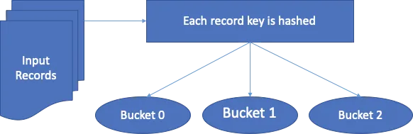

# Introduction

Bucketing in Spark is a data organization technique used primarily in Spark SQL, particularly with DataFrames and Spark SQL tables. It is similar to partitioning but is employed to further control data distribution across the cluster, specifically to optimize join and aggregation operations.



## What is Bucketing in Spark?
Bucketing involves distributing data across a fixed number of buckets based on a hash function applied to a column or set of columns. Each bucket is stored as a separate physical file within a directory corresponding to a table in the file system. This allows Spark to read only a relevant subset of data during joins or aggregations, which can lead to significant performance improvements.

## Key Concepts of Bucketing
1. **Hash Partitioning**: Data is partitioned based on the hash value of one or more columns. This ensures that data with the same bucketing key is always stored in the same bucket.
2. **Bucket Join**: Joins can be significantly optimized with bucketing. If two tables are bucketed on the same columns, Spark can join them by shuffling only the buckets with matching keys instead of the entire datasets.
3. **Bucketed Aggregation**: Similarly to joins, bucketing can improve the efficiency of aggregations by grouping data into buckets such that each bucket can be aggregated independently in parallel.

## Example of Bucketing in Spark

Suppose we have two DataFrames, orders and order_items, which we frequently need to join and aggregate. Here’s how you can use bucketing to optimize these operations:

```python
from pyspark.sql import SparkSession
from pyspark.sql.functions import col

# Initialize a Spark session
spark = SparkSession.builder.appName("Bucketing Example").getOrCreate()

# Sample data
orders_data = [(1, "2020-07-21"), (2, "2020-07-22"), (3, "2020-07-23")]
order_items_data = [(1, 1, 100), (2, 1, 150), (3, 2, 200)]

# Creating DataFrames
orders = spark.createDataFrame(orders_data, ["order_id", "date"])
order_items = spark.createDataFrame(order_items_data, ["item_id", "order_id", "amount"])

# Writing bucketed data
(orders
    .write
    .bucketBy(4, "order_id")
    .sortBy("order_id")
    .saveAsTable("orders_bucketed"))

(order_items
    .write
    .bucketBy(4, "order_id")
    .sortBy("order_id")
    .saveAsTable("order_items_bucketed"))

# Performing a bucket join
bucketed_orders = spark.table("orders_bucketed")
bucketed_order_items = spark.table("order_items_bucketed")
bucket_join = bucketed_orders.join(bucketed_order_items, "order_id")
bucket_join.explain()
```

In this example, both orders and order_items are bucketed on the column order_id and stored as Hive-style bucketed tables. When these tables are joined, Spark can efficiently perform the join by only shuffling the corresponding buckets (i.e., files) with the same order_id.

## Difference Between Bucketing and Partitioning
- **Granularity**: Partitioning splits data into separate directories based on column values, which can be great for filtering large datasets but can lead to a large number of small files if not managed carefully. Bucketing, however, divides data into a fixed number of files (buckets), controlling file size more effectively.
- **Optimization**: While both techniques are used to optimize query performance, bucketing is particularly effective for optimizing joins and aggregations on large tables. Partitioning is generally used for distributing data across nodes to minimize data reads that don't pertain to the queries.
- **Data Skew**: Partitioning can sometimes lead to uneven distribution of data (data skew) if the partition key is not chosen carefully. Bucketing mitigates this by distributing data more evenly based on the hash of the key.
Bucketing in Spark is a powerful feature for optimizing performance, especially in data warehousing scenarios. By using bucketing alongside partitioning, you can significantly enhance the efficiency of your Spark applications, particularly when dealing with large-scale data operations.